🏥 AI Health Insights Platform

📌 Description

AI Health Insights Platform is a web-based application built using Python and Flask. It helps users track their health data and provides intelligent insights such as BMI calculation, calorie tracking, water intake, and chatbot-based assistance.

\---

🚀 Features

\- 🧮 BMI Calculator

\- 🔥 Calorie Tracker

\- 💧 Water Intake Tracker

\- 🤖 AI Chatbot for health queries

\- 📊 Dashboard to view user data

\- 🔐 User Authentication (Login \& Signup)

\---

🛠️ Tech Stack

\- Python

\- Flask

\- HTML

\- CSS

\- JavaScript

\- SQLite

\- AI chatbot (API / Rule-based)

\---

⚙️ How It Works

1\. User signs up or logs into the platform

2\. User inputs health-related data (BMI, calories, water intake, etc.)

3\. Data is processed using backend logic (Flask \& Python)

4\. Results and insights are displayed on the dashboard

5\. Chatbot helps users with health-related queries

\---

📂 Project Structure

\- "app.py" → Main Flask application

\- "chatbot\_api.py" → Chatbot logic

\- "templates/" → HTML files

\- "static/" → CSS, JS, images

\- "requirements.txt" → Dependencies

\---

⚙️ Installation \& Setup

1\. Clone the repository:

git clone https://github.com/kirtisahu82/AI-Health-Insights-Platform.git

2\. Navigate to the project folder:

cd AI-Health-Insights-Platform

3\. Install dependencies:

pip install -r requirements.txt

4\. Run the application:

python app.py

5\. Open browser:

http://127.0.0.1:5000/

\---

<<<<<<< HEAD
=======
📸 Screenshots

## 📸 Screenshots

### 🏠 Home Page
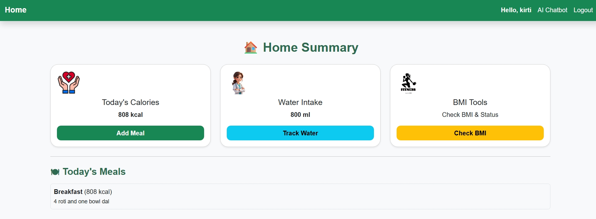

### 🔐 Login Page
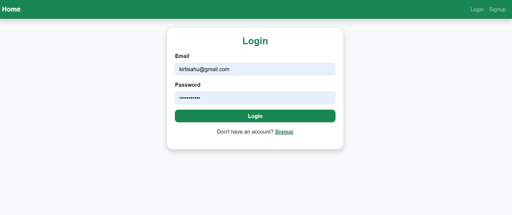

### 📝 Signup Page
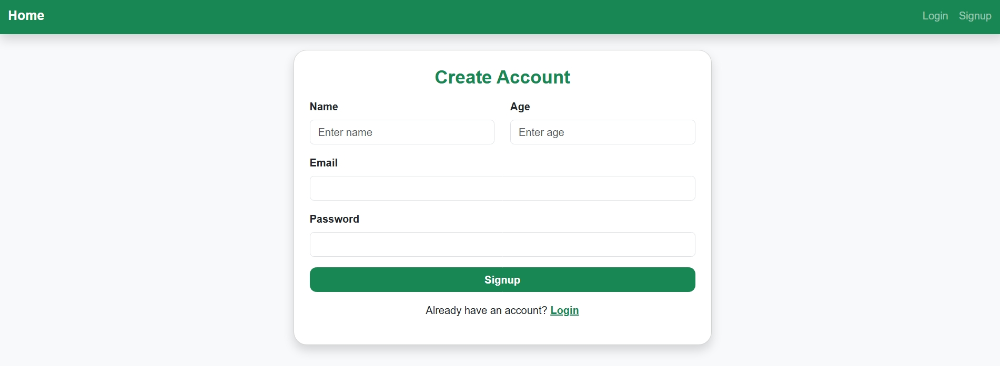

### 🚪 Logout Page
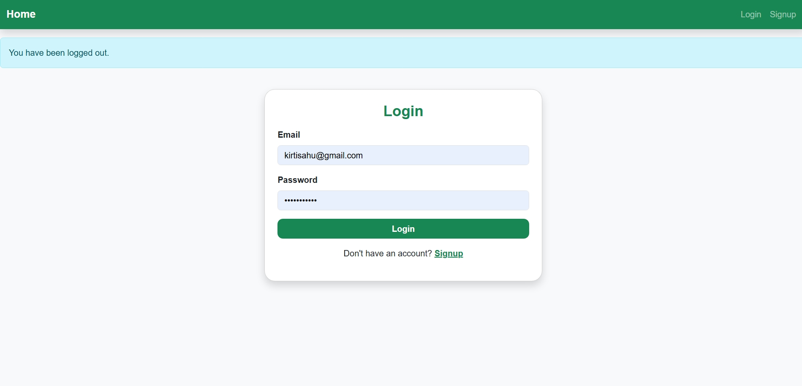

### 📊 Dashboard
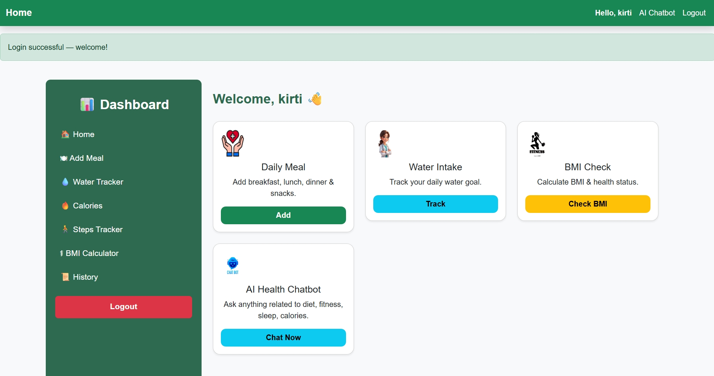

### 🧮 BMI Calculator
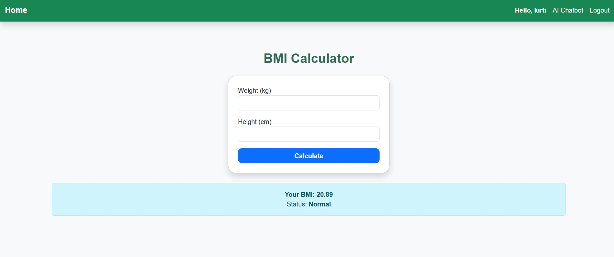

### 🔥 Calories Tracker
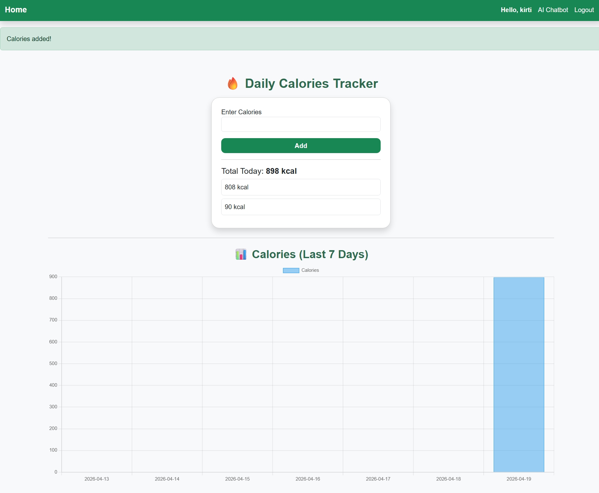

### 💧 Water Intake Tracker
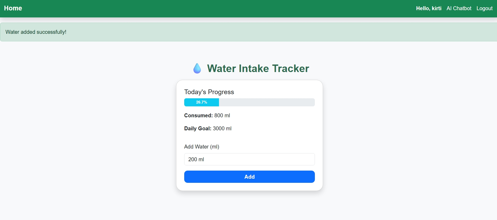

### 👣 Steps Tracker
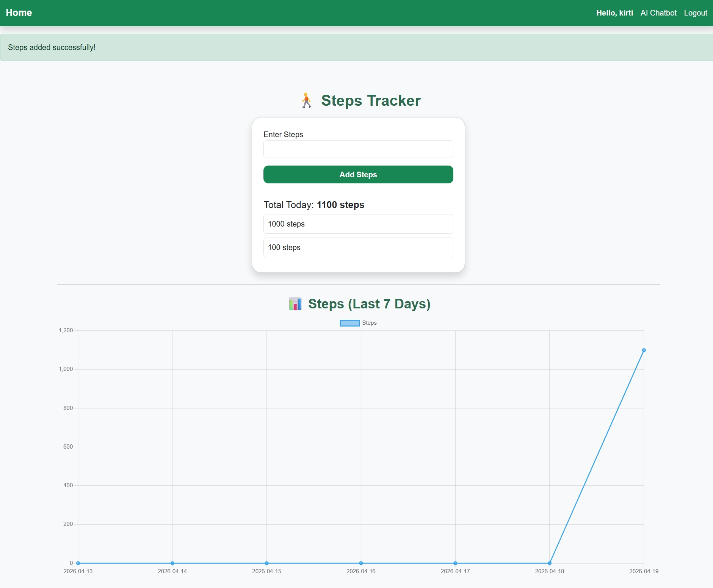

### 🍽️ Add Meal
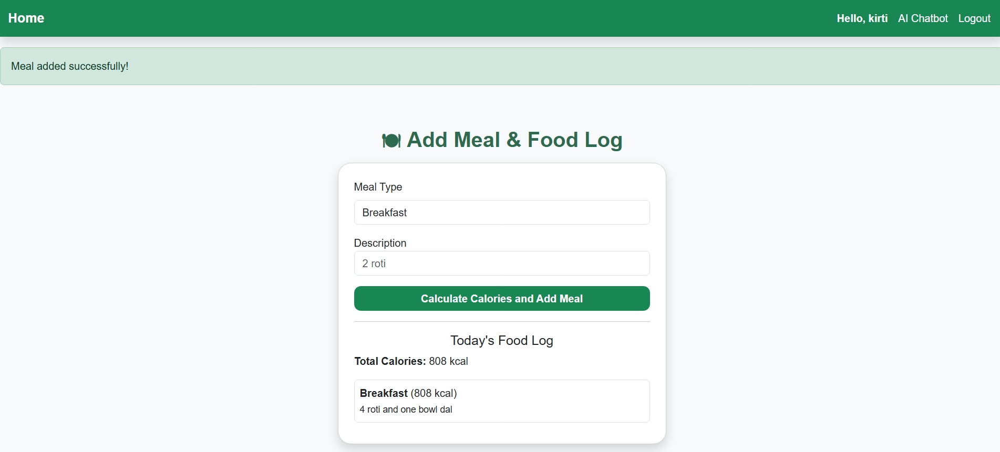

### 📜 History
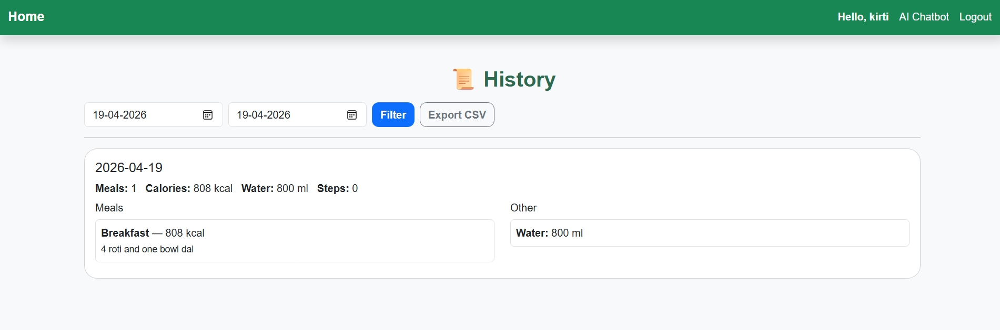

### 🤖 AI Chatbot
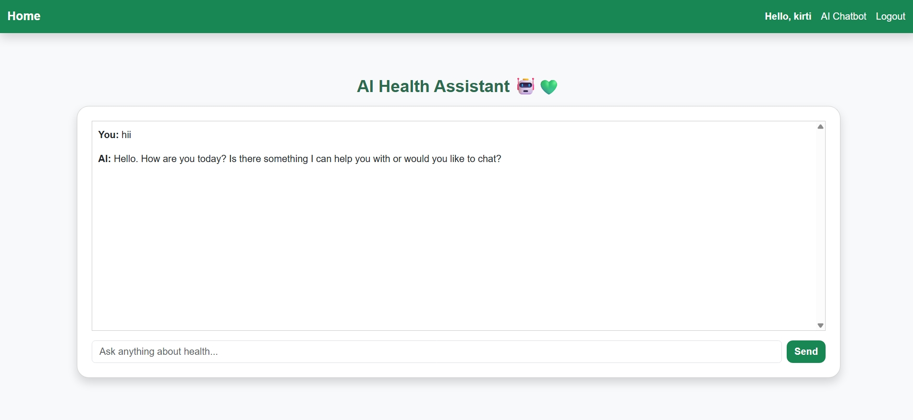

\---

## 💡 Real World Use Case

This platform helps users monitor their daily health metrics like BMI, calories, and water intake, and provides intelligent suggestions for a healthier lifestyle.

\---

>>>>>>> bc358c5 (added all screenshots)

❗ Important Notes

\- Do not upload ".env" file (contains secret keys)

\- If using any API, replace with your own API key

\- Database file (".db") is not included for security reasons

\- Make sure all dependencies are installed before running

\---

🎯 Interview Tips (For This Project)

\- Explain the flow of data (Frontend → Backend → Database)

\- Be ready to explain how Flask routes work

\- Explain how chatbot logic is implemented

\- Highlight problem-solving: why you built this project

\- Mention real-world use case (health tracking system)

\---

🌟 Future Improvements

\- Add more AI-based predictions

\- Improve UI/UX

\- Deploy on cloud (Render / Railway)

\- Add real-time data tracking

\---

⭐ Support

If you like this project, don’t forget to ⭐ star the repository on GitHub!

\---

👩‍💻 Author

Kriti Sahu

